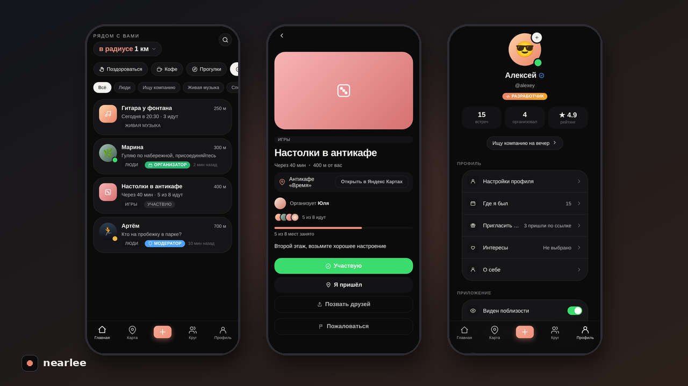
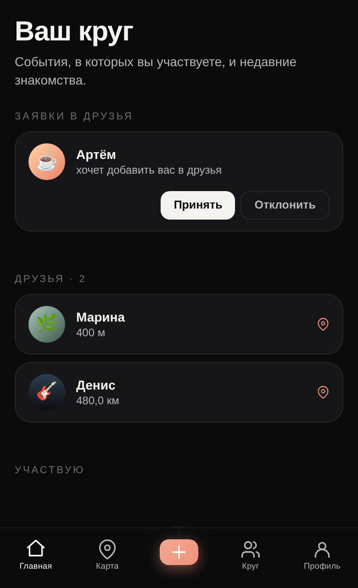
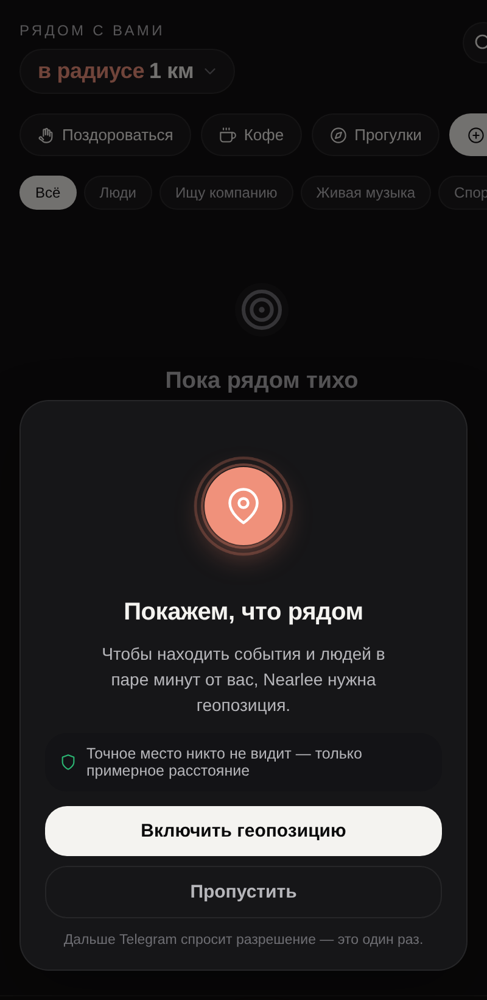
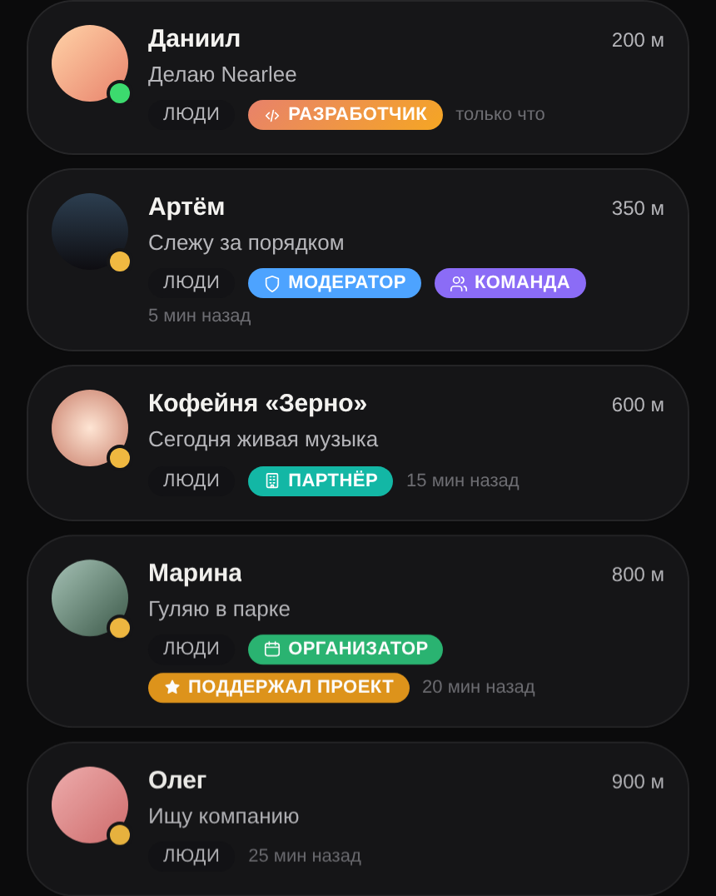

  

<h1 align="center">Nearlee</h1>

  <b>Что рядом — уже происходит.</b> 
  Люди и события в паре минут от вас — прямо в Telegram.

  <a href="https://t.me/NearleeBot">Открыть в Telegram</a> ·
  <a href="https://nearlee.ru">nearlee.ru</a>

  

---

## О проекте

Мы научились общаться с людьми за тысячи километров, но человек в десяти метрах от нас может так и остаться незнакомцем. Nearlee показывает, что происходит вокруг прямо сейчас: кто рядом ищет компанию на прогулку, где через час собираются на настолки, кто играет на гитаре у фонтана.

Nearlee работает как мини-приложение в Telegram — ничего не нужно устанавливать.

## Что умеет

- **Лента «рядом»** — люди и события в выбранном радиусе, от пары сотен метров до города.
- **События** — создайте встречу за минуту, выберите место на карте, отметьтесь «Я пришёл».
- **Карта** — события, фото красивых мест и люди поблизости.
- **Друзья** — добавляйте тех, с кем встречаетесь, и видьте их на карте даже в другом городе.
- **Значки** — «Проводник» и «Основатель» за друзей, которые пришли на встречи.
- **Бот** — `/nearby`, `/my`, `/invite`: что рядом и ваши планы без открытия приложения.

  
  

## Безопасность и приватность

- **Точное место не видит никто.** Другим людям показывается только примерная область.
- **Точное место — только взаимным друзьям**, и только если вы сами это включили.
- **Оценки — только после настоящей встречи**, когда вы оба отметились на одном событии.
- **Сервис для взрослых: 18+.** Возраст проверяется несколькими способами, включая видео-проверку модератором.
- **Модерация** — жалобы, блокировки и ручная проверка спорных случаев.

  

## Видео

[Смотреть тизер](media/nearlee-teaser.mp4)

## Статус

Проект в открытом тесте. Исходный код закрыт и в этом репозитории не публикуется.

## Контакты

- Бот: [@NearleeBot](https://t.me/NearleeBot)
- Автор: [@reshapiz](https://t.me/reshapiz)
- Нашли уязвимость? См. [SECURITY.md](SECURITY.md)

---

<b>English</b>

**Nearlee** — what's nearby is already happening. A Telegram Mini App that shows people and happenings a few minutes away from you: someone looking for company on a walk, board games in an hour, a guitar by the fountain.

Features: a nearby feed, happenings with check-ins, a map, friends visible even in other cities, badges for inviting friends, and a bot with `/nearby`, `/my`, `/invite`.

Privacy first: nobody sees your exact location except mutual friends you allow; ratings only after a real meeting; 18+ with moderator video verification.

The source code is closed and is not published in this repository.

---

  © 2026 Nearlee. Все права защищены. См. <a href="LICENSE">LICENSE</a>.

